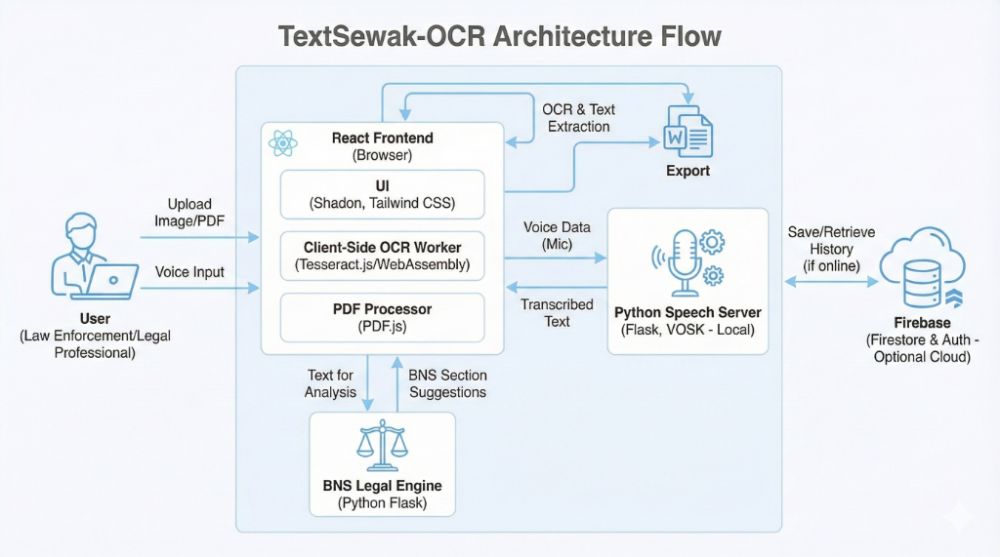

# TextSewak-OCR 🇮🇳

**TextSewak** is an advanced Gemini Powered OCR and Legal Assistance platform designed specifically for Indian law enforcement and legal professionals. It combines powerful client-side processing with specialized offline capabilities to ensure data privacy, speed, and reliability without persistent internet dependence.


*(Generate a visual using the prompt in `Document/SYSTEM_PIPELINE.md`)*

## 🚀 Quick Start (One-Click)
We have added a simple batch script to start all servers (Legal Engine, Speech, Frontend) automatically!
1. Double-click `run_textsewak.bat` in the project folder.
2. Wait for the terminal windows to open and initialize.
3. The app will automatically open in your browser at `http://localhost:8080`.

## 🚀 Key Features

### 1. 📝 Intelligent OCR (Optical Character Recognition)
*   **Gemini Processing**: Runs entirely in the browser using WebAssembly (Gemini and Tesseract.js).
*   **Multi-Format Support**: Extracts text from Images (JPG, PNG) and PDF documents.
*   **Hindi & English**: Optimized for Devanagari script and English text.
*   **History**: Auto-saves processed documents to Firebase for easy retrieval.

### 2. 🎙️ Offline Voice Dictation (Speech-to-Text)
*   **Zero-Internet Required**: Uses a local Python server with VOSK models.
*   **Privacy-First**: Audio never leaves your local machine.
*   **Real-time Editing**: Dictate directly into the OCR result box to make corrections.

### 3. ⚖️ BNS Legal Engine (Advanced Analysis)
*   **Context-Aware Justice**: Analyzes FIR descriptions to suggest accurate **Bharatiya Nyaya Sanhita (BNS)** sections.
*   **Granular Matching**: Implementation of sentence-level similarity search to find the exact legal provision.
*   **Top-K Results**: Returns the top 3 most relevant sections with confidence scores.
*   **Fully**: Uses local `sentence-transformers`—no data leaves your machine.
*   **Voice-to-FIR**: Generate formal FIR complaints just by speaking details in Hindi.
*   **Export**: Download complaints as formatted Microsoft Word (`.docx`) or Text (`.txt`) files.

## 🏠 Local & Offline Mode
You can run TextSewak entirely offline without setting up Firebase.

### 🔑 Offline Credentials
Use these credentials to log in without internet:
*   **Email**: `offline@gmail.com`
*   **Password**: `offline`

### Features in Local Mode
*   ✅ **Automatic Detection**: Defaults to Local Mode if `.env` is missing.
*   ✅ **OCR & PDF Extraction**: Works perfectly (Browser-based).
*   ✅ **Offline Voice Dictation**: Works perfectly (Python Server).
*   ✅ **BNS Legal Analysis**: Works perfectly (Local Python Server).
*   ❌ **Cloud History**: Disabled (requires Firebase).

---

## 🏗️ Technical Architecture

*   **Frontend**: React 18, Vite, Tailwind CSS, Shadcn UI
*   **Backend (Speech)**: Python Flask, VOSK (Offline ASR), PyAudio
*   **Database**: Firebase Firestore  & Authentication
*   **OCR Engine**: Tesseract.js (Client-Side Worker)
*   **PDF Engine**: PDF.js

*(See `Document/SYSTEM_PIPELINE.md` for a detailed technical deep dive)*

---

## 🛠️ Installation & Setup

### Prerequisites
*   **Node.js** (v18+)
*   **Python** (v3.9+)
*   **Git**

### 1. Clone the Repository
```bash
git clone https://github.com/niteshislol/TextSewak.git
cd TextSewak
```

### 2. Frontend Setup (Client)
```bash
# Install dependencies
npm install

# Start the development server
npm run dev
# App runs at http://localhost:8080
```

### 3. Offline Speech Server Setup (Required for Voice Features)
The offline speech engine runs on a separate Python local server.

```bash
cd textsewakspeech/
# Install Python dependencies
pip install flask flask-cors vosk pyaudio

# Download VOSK Model
# 1. Download 'vosk-model-hi-small-0.22' (or similar Hindi model)
# 2. Extract and rename the folder to 'model' inside 'textsewak_speech/'

# Run the server
python offline_app.py
# Server runs at http://localhost:5056
```

### 4. BNS Legal Engine Setup (For Legal Analysis)
This service analyzes text to suggest relevant BNS sections.

```bash
cd "BNS Legal Engine"
# Install dependencies
pip install flask sentence-transformers scikit-learn numpy

# Run the Legal Engine Server
python app.py
# Server runs at http://localhost:5053
```

---

## 📖 Usage Guide

### OCR & Document Analysis
1.  Navigate to the **App** page (`/app`).
2.  Upload an image or document.
3.  Wait for extraction.
4.  Use the **Mic button** to dictate corrections if needed.
5.  Click **Export** to save as PDF/Word.

### Generating an FIR (Offline)
1.  Navigate to **Generate FIR** (`/generate`).
2.  Select a category (e.g., Theft, Cyber Fraud).
3.  Click the **Mic icon** next to any field.
4.  Speak in Hindi (e.g., "Mera naam Rahul hai").
5.  The system converts speech to text instantly.
6.  Click **Download Word** to get the printable complaint.

---

## 📂 Project Structure

```
TextSewak-OCR/
├── client/                 # React Frontend Code
│   ├── components/         # UI Components (OcrResult, HowToUse, etc.)
│   ├── pages/              # Main Pages (Index, Generate, etc.)
│   └── lib/                # Utilities (Firebase, utils)
├── textsewak_speech/       # Python Offline Speech Server
│   ├── offline_app.py      # Flask Server Entry
│   └── model/              # VOSK Offline Model (Download separately)
├── "BNS Legal Engine"/     # Legal Analysis Service
│   ├── app.py              # Legal Engine Server
│   ├── legal_classifier.py # Logic for Section Matching
│   ├── bns.json            # Bharatiya Nyaya Sanhita Data (English)
│   └── bns_hindi.json      # Bharatiya Nyaya Sanhita Data (Hindi)
├── Document/               # Technical Documentation
│   ├── SYSTEM_PIPELINE.md  # Architecture & Visual Prompt
│   └── PROJECT_ANALYSIS.md # Optimization Report
└── vite.config.ts          # Vite Configuration
```

## 🤝 Contributing
Contributions are welcome! Please check the `Document/` folder for the roadmap and current task lists.

## 📄 License
[MIT License](LICENSE)
